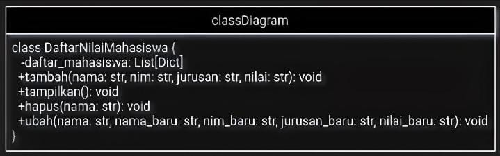
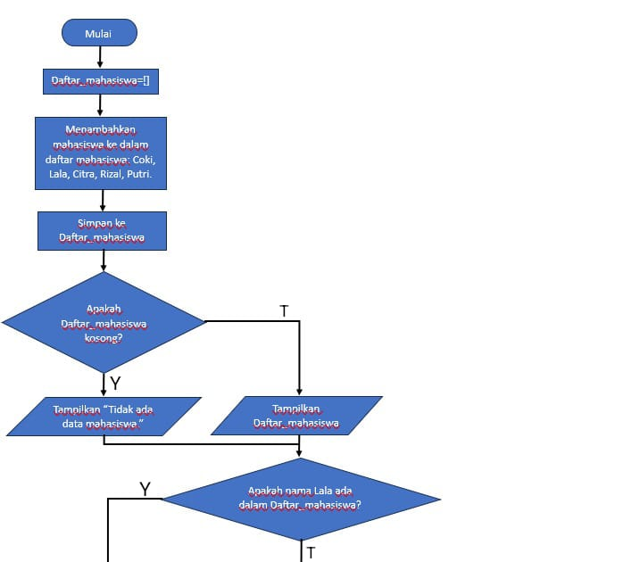
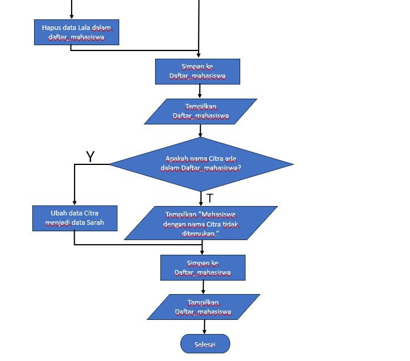
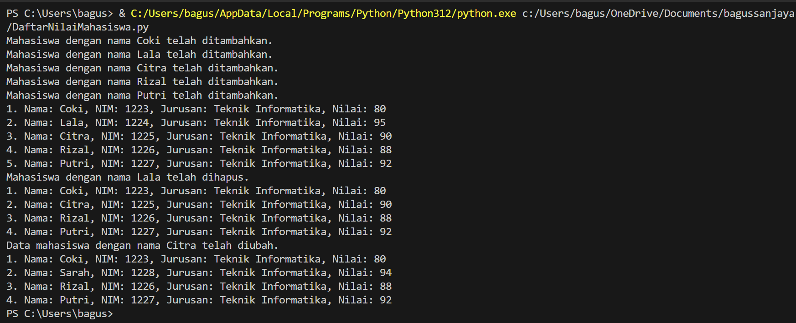

# praktikum_8

Nama: Bagus Sanjaya

NIM: 312410505

Kelas: TI.24.A.5

## Ini Diagram class dari program yang saya buat



## Ini flowchart dari program yang saya buat





## Ini penjelasan dari program yang saya buat

1. Inisialisasi Class
```python
class DaftarNilaiMahasiswa:
    def __init__(self):
        self.daftar_mahasiswa = []
```

Class DaftarNilaiMahasiswa memiliki satu atribut yaitu daftar_mahasiswa yang diinisialisasi sebagai daftar kosong untuk menyimpan data mahasiswa.

2. Method untuk menambahkan data
```python
def tambah(self, nama, nim, jurusan, nilai):
    mahasiswa = {'nama': nama, 'nim': nim, 'jurusan': jurusan, 'nilai': nilai}
    self.daftar_mahasiswa.append(mahasiswa)
    print(f"Mahasiswa dengan nama {nama} telah ditambahkan.")
```

Method tambah menerima empat parameter: nama, nim, jurusan, dan nilai. Method ini membuat dictionary mahasiswa yang menyimpan informasi tersebut dan menambahkannya ke daftar_mahasiswa.

3. Method untuk menampilkan data
```python
def tampilkan(self):
    if not self.daftar_mahasiswa:
        print("Tidak ada data mahasiswa.")
    else:
        for i, mahasiswa in enumerate(self.daftar_mahasiswa, start=1):
            print(f"{i}. Nama: {mahasiswa['nama']}, NIM: {mahasiswa['nim']}, Jurusan: {mahasiswa['jurusan']}, Nilai: {mahasiswa['nilai']}")
```

Method tampilkan menampilkan data semua mahasiswa yang ada di daftar_mahasiswa. Jika daftar kosong, akan muncul pesan "Tidak ada data mahasiswa."

4. Method untuk menghapus data
```python
def hapus(self, nama):
    self.daftar_mahasiswa = [mahasiswa for mahasiswa in self.daftar_mahasiswa if mahasiswa['nama'] != nama]
    print(f"Mahasiswa dengan nama {nama} telah dihapus.")
```

Method hapus menghapus data mahasiswa dari daftar_mahasiswa berdasarkan nama. Jika ditemukan mahasiswa dengan nama tersebut, data akan dihapus dan daftar diperbarui.

5. Method untuk mengubah data
```python
def ubah(self, nama, nama_baru=None, nim_baru=None, jurusan_baru=None, nilai_baru=None):
    for mahasiswa in self.daftar_mahasiswa:
        if mahasiswa['nama'] == nama:
            if nama_baru:
                mahasiswa['nama'] = nama_baru
            if nim_baru:
                mahasiswa['nim'] = nim_baru
            if jurusan_baru:
                mahasiswa['jurusan'] = jurusan_baru
            if nilai_baru:
                mahasiswa['nilai'] = nilai_baru

            print(f"Data mahasiswa dengan nama {nama} telah diubah.")
            return
    print(f"Mahasiswa dengan nama {nama} tidak ditemukan.")
```

Method ubah memungkinkan perubahan data mahasiswa berdasarkan nama. Jika nama ditemukan dalam daftar_mahasiswa, data akan diperbarui sesuai dengan parameter yang diberikan dan kemudian method akan berhenti (return).

6. Contoh Penggunaan
Berikut contoh penggunaan class DaftarNilaiMahasiswa:
```python
# Membuat instance dari class DaftarNilaiMahasiswa
daftar_nilai = DaftarNilaiMahasiswa()

# Menambah data mahasiswa
daftar_nilai.tambah("Coki", "1223", "Teknik Informatika", "80")
daftar_nilai.tambah("Lala", "1224", "Teknik Informatika", "95")
daftar_nilai.tambah("Citra", "1225", "Teknik Informatika", "90")
daftar_nilai.tambah("Rizal", "1226", "Teknik Informatika", "88")
daftar_nilai.tambah("Putri", "1227", "Teknik Informatika", "92")

# Menampilkan data mahasiswa
daftar_nilai.tampilkan()

# Menghapus data mahasiswa
daftar_nilai.hapus("Lala")

# Menampilkan data mahasiswa setelah dihapus
daftar_nilai.tampilkan()

# Mengubah data mahasiswa
daftar_nilai.ubah("Citra", nama_baru="Sarah", nim_baru="1228", jurusan_baru="Teknik Informatika", nilai_baru="94")

# Menampilkan data mahasiswa setelah diubah
daftar_nilai.tampilkan()
```

## Ini hasil/output dari program yang saya buat


